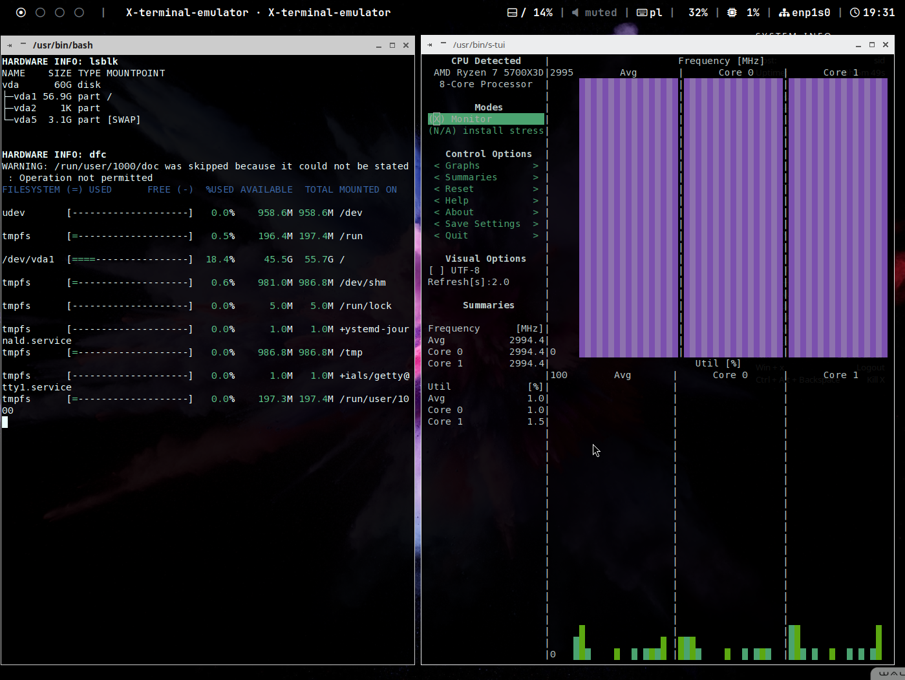
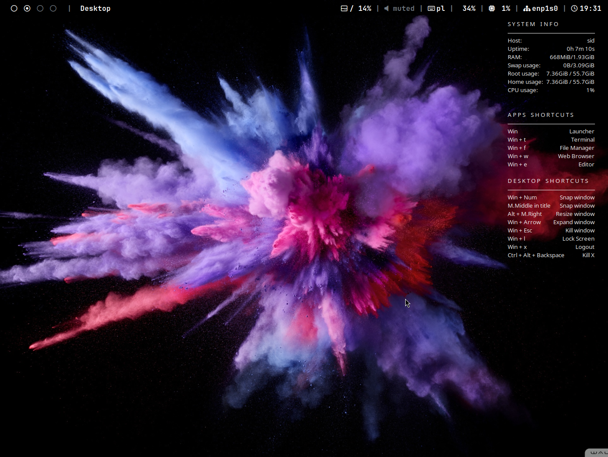

# My Linux Config

**Config files for polybar and Openbox litght linux.**

**Zentile is used for tiling.**
https://github.com/blrsn/zentile

**Openbox is installed by script from** https://github.com/leomarcov/debian-openbox.

**Polywins script is used for taskbar part of polybar.** https://github.com/uniquepointer/polywins

**Font setup for polybar icons:**

mkdir -p ~/.local/share/fonts

cd ~/.local/share/fonts

wget https://github.com/ryanoasis/nerd-fonts/releases/latest/download/JetBrainsMono.zip

unzip JetBrainsMono.zip -d JetBrainsMono

fc-cache -fv

fc-list | grep -i "nerd”

**Needed aps when installing without debian-openbox scripts**

sudo apt install mc screen neovim git lightdm lightdm-gtk-greeter arandr openbox xorg terminator firefox-esr lxappearance polybar thunar xrdp wmctrl htop xrdp rofi xcape gedit inxi hwinfo dfc s-tui compton

sudo update-alternatives --install /usr/bin/x-text-editor x-text-editor /usr/bin/gedit 50   
Command needed to use gedit to edit conf and display some info from menu
